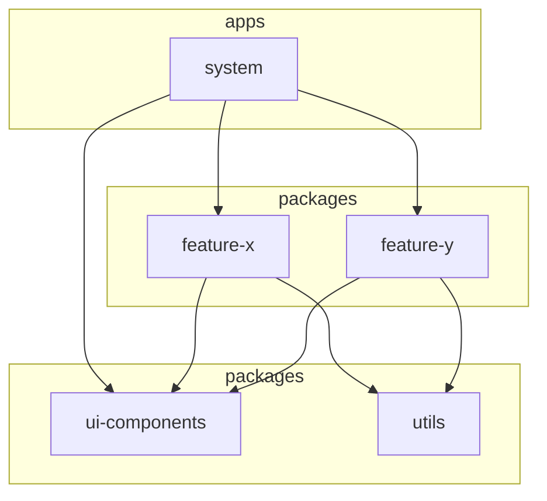

# Modular monorepo

Production-style **npm workspaces** monorepo with **Turborepo** task orchestration, **TypeScript (ESM)**, and **React 18**. Packages are independently versionable, typed, and consumed through explicit `package.json` exports.

Nx was not scaffolded here because an existing `.git` tree prevented `create-nx-workspace` from using the current directory; the same layout maps cleanly to Nx if you later run `nx init` and migrate tasks.

## Layout

```
apps/system              # Vite shell: routing + layout only (no feature logic)
packages/utils           # Pure TS utilities + fetch API client
packages/ui-components   # React + Tailwind + Radix (design-system primitives)
packages/feature-x       # Task manager feature (Zustand + UI + utils)
packages/feature-y       # Notes feature (Zustand + UI + utils)
```

## Boundaries

- **No imports between `feature-x` and `feature-y`**. They only talk through the app shell (or future shared contracts you add deliberately).
- **`ui-components` stays generic**: primitives only, no domain rules.
- **`system` composes** routes and chrome; business rules live inside feature packages.

## Requirements

- Node.js **20+**
- npm **9+** (workspaces)

## Setup

```bash
npm install
```

Build libraries first so `exports.types` resolve to `dist/*.d.ts` (required for `tsc` across packages):

```bash
npm run build
```

## Scripts

| Script            | Description                                      |
| ----------------- | ------------------------------------------------ |
| `npm run dev`     | Start `@repo/system` (Vite) on port **5173**     |
| `npm run build`   | Turbo pipeline: packages then Vite production  |
| `npm run typecheck` | `tsc` in each package (waits on `^build` graph) |
| `npm run test`    | Vitest in each workspace                         |
| `npm run lint`    | ESLint (flat config)                             |
| `npm run format`  | Prettier write                                   |

## Architecture



- **Vite** bundles workspace sources using `package.json` `exports` (runtime → `src`, types → `dist`).
- **Turborepo** orders `build` tasks via workspace dependency edges (`^build`).
- **Vitest** runs per package; UI tests use `jsdom`.

## Package index

| Package            | Role                                                |
| ------------------ | --------------------------------------------------- |
| `@repo/utils`      | Dates, strings, debounce, `createApiClient`, errors |
| `@repo/ui-components` | Buttons, cards, dialog, layout, Tailwind preset |
| `@repo/feature-x`  | Task list + Zustand store                           |
| `@repo/feature-y`  | Notes + search debounce + Zustand store             |

See each package’s `README.md` for structure and consumption notes.
